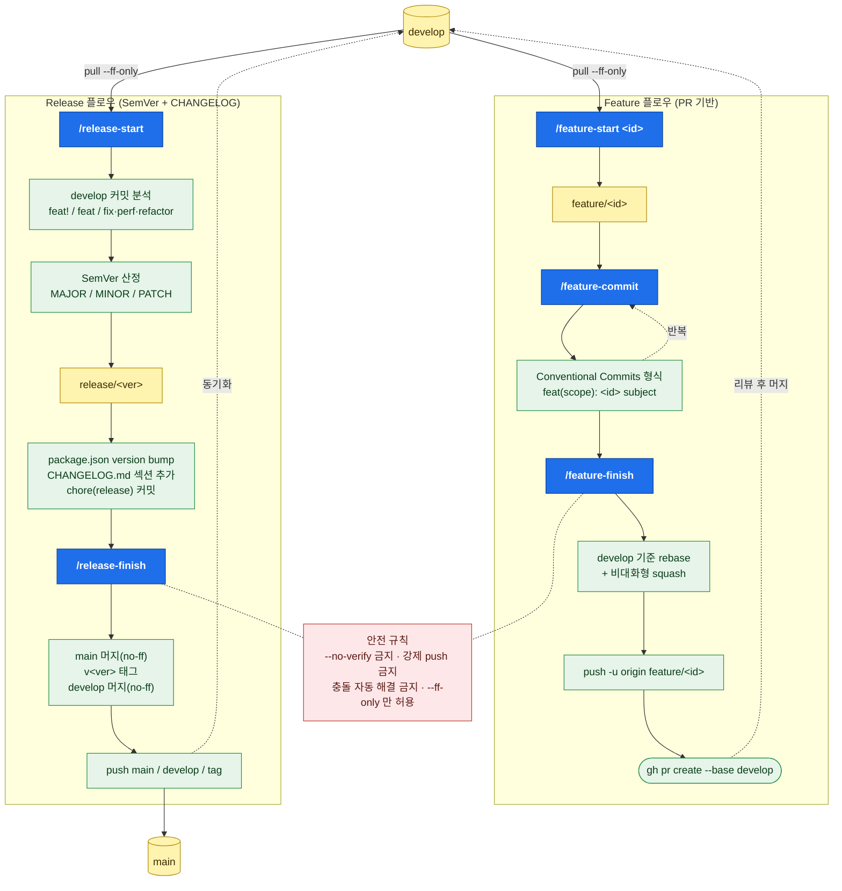

# git-flow-sph

> git-flow + Conventional Commits + SemVer 자동화 Claude Code 플러그인 (SPH)

Feature 개발과 Release 작업을 두 갈래의 슬래시 커맨드로 자동화합니다.
모든 커맨드는 **PR 기반 워크플로우**를 전제로 합니다 (`git flow feature finish`는 사용하지 않음).

---

## 설치

### GitHub 저장소에서 바로 설치 (권장)

Claude Code 안에서 두 줄만 실행하면 됩니다.

```
/plugin marketplace add JihoonKim0305/gitflow-sph
/plugin install git-flow-sph@gitflow-sph
```

- 1줄: 이 저장소를 플러그인 마켓플레이스로 등록 (루트의 [.claude-plugin/marketplace.json](.claude-plugin/marketplace.json) 매니페스트를 읽음)
- 2줄: 마켓플레이스의 `git-flow-sph` 플러그인을 설치

설치 후 `/plugin` 으로 활성 상태를 확인할 수 있고, 슬래시 커맨드 `/feature-start`, `/feature-commit`, `/feature-finish`, `/feature-cleanup`, `/feature-cleanup-all`, `/release-start`, `/release-finish`, `/monday-token`, `/monday-init` 가 노출됩니다.

업데이트는 `/plugin marketplace update gitflow-sph` 후 `/plugin install git-flow-sph@gitflow-sph` 를 다시 실행하면 됩니다.

### 로컬 디렉터리로 설치 (오프라인/개발용)

```bash
git clone https://github.com/JihoonKim0305/gitflow-sph.git
# Claude Code 에서:
#   /plugin marketplace add <클론한 절대경로>
#   /plugin install git-flow-sph@gitflow-sph
```

### 의존성

- `git` (2.30+ 권장)
- `git-flow` (AVH edition 권장: `brew install git-flow-avh`)
- `gh` (GitHub CLI) — PR 생성용. 없으면 `/feature-finish` 가 push 까지만 수행하고 안내.
- `jq` 또는 `node` — `package.json` 버전 갱신용 (선택).

저장소 초기 세팅:

```bash
git flow init -d   # 기본값 사용 (main / develop)
gh auth status     # 인증 확인
```

---

## 슬래시 커맨드

| 커맨드 | 용도 |
|---|---|
| `/feature-start <id-or-name>` | develop 최신화 후 `git flow feature start` |
| `/feature-commit [메시지 힌트]` | Conventional Commits 형식 커밋 (Feature ID 자동 포함) |
| `/feature-finish` | squash rebase → push → `gh pr create` |
| `/feature-cleanup [id]` | PR 머지 확인 후 로컬/원격 feature 브랜치 안전 삭제 (id 미지정 시 현재 브랜치 또는 후보 선택) |
| `/feature-cleanup-all` | 내가 author 인 머지된 feature 브랜치를 일괄 조회 → 사용자 확인 1회 → 일괄 삭제 |
| `/release-start [--major\|--minor\|--patch]` | SemVer 산정 → `git flow release start` → package.json/CHANGELOG 갱신 |
| `/release-finish` | release → main/develop 머지 + 태그 + push + Monday Release 보드 기록 |
| `/monday-token <TOKEN>` | Monday.com API 토큰을 `~/.claude/.gitflow-sph-monday.token` 에 저장 (`--clear` 로 삭제) |
| `/monday-init [board_id]` | 프로젝트 루트에 `monday.config.json` 생성 (토큰 있으면 컬럼 자동 매핑) |

---

## 전체 워크플로우 흐름도



- **파란 박스** = 슬래시 커맨드, **노란 박스** = git 브랜치, **초록 박스** = 자동 수행 작업, **빨간 박스** = 모든 커맨드 공통 안전 규칙.
- `develop` / `main` 은 항상 `--ff-only` 로만 최신화하며, 커맨드 어떤 단계에서도 충돌·non-ff 가 발생하면 즉시 중단됩니다.

---

## 사용 시나리오

### Feature 시나리오

```bash
# 1. 작업 시작
/feature-start 11754215659
#   → develop pull --ff-only
#   → git flow feature start 11754215659
#   → 현재 브랜치: feature/11754215659

# 2. 코드 수정 후 커밋 (필요한 만큼 반복)
/feature-commit "토큰 만료 시 401 처리 추가"
#   → feat(auth): 11754215659 handle 401 on expired token
#     <body>

# 3. 마무리: squash + push + PR
/feature-finish
#   → develop pull --ff-only
#   → git rebase develop
#   → git rebase -i HEAD~N (비대화형 squash)
#   → git push -u origin feature/11754215659
#   → gh pr create --base develop
```

원격에 같은 브랜치가 이미 있는 경우 `/feature-finish` 는 자동으로 force push 하지 않고 **사용자에게 어떻게 진행할지 묻고 중단**합니다.

```bash
# 4. PR 이 머지된 뒤 정리
/feature-cleanup 11754215659
#   → PR #<num> merged 여부 확인 (gh pr list)
#   → develop pull --ff-only
#   → git branch -d feature/11754215659      (미머지 커밋 있으면 중단)
#   → git push origin --delete feature/11754215659  (이미 사라졌으면 스킵)
#   → git fetch --prune origin

# 또는 인자 없이 호출하면:
#   - 현재 브랜치가 feature/<x> 면 그것을 대상으로
#   - 아니면 "내가 author 인 머지된 PR" 후보를 보여주고 선택

# 여러 개를 한 번에:
/feature-cleanup-all
#   → 내가 author 인 merged PR ∩ 로컬 feature/* 교집합 조회
#   → 사용자 확인 1회 → 일괄 삭제 (각 브랜치 독립 처리)
```

### Release 시나리오

```bash
# 1. 릴리즈 준비
/release-start
#   → develop 커밋 분석 → 다음 버전 후보 1~3개 제시
#   → 사용자 확정 → git flow release start <version>
#   → package.json version bump
#   → CHANGELOG.md 갱신 (Keep a Changelog 포맷)
#   → chore(release): <version> 커밋

# (선택) 릴리즈 브랜치에서 추가 수정 및 일반 커밋

# 2. 릴리즈 마무리
/release-finish
#   → main/develop pull --ff-only
#   → git flow release finish -f <changelog-section>
#     - main 머지 (no-ff)
#     - v<version> 태그 (메시지: CHANGELOG 해당 섹션)
#     - develop 머지 (no-ff)
#     - release 브랜치 삭제
#   → push main / develop / 태그
```

릴리즈 도중 충돌이 발생하면 **자동 해결하지 않고**, `git merge --abort` + 모든 브랜치/태그를 시작 전 SHA 로 reset 한 뒤 사용자에게 보고합니다.

---

## 안전 규칙 (모든 커맨드 공통)

1. **`--no-verify` 금지** — pre-commit hook 실패 시 그대로 보고하고 중단.
2. **강제 푸시 금지** — `--force`, `--force-with-lease` 자동 수행 안 함. 필요해 보이면 사용자에게 결정 위임.
3. **머지 기준 브랜치 최신화는 `--ff-only` 만** — non-ff 발생 시 즉시 중단.
4. **충돌 자동 해결 금지** — `rebase --abort` / `merge --abort` 로 원상복구.
5. **한 커밋 = 하나의 논리적 변경** — Conventional Commits + Feature ID.
6. **`git add -A` / `.` 금지** — 파일을 명시적으로 지정해 스테이징.

---

## 커밋 메시지 포맷

```
<type>[(<scope>)]: <feature-id> <subject>

<body — 왜 변경했는지에 초점>
```

type: `feat` / `fix` / `refactor` / `docs` / `test` / `chore` / `style` / `perf` / `ci`
BREAKING CHANGE 는 type 뒤에 `!` 또는 body 에 `BREAKING CHANGE:` 표기.

---

## SemVer 산정 규칙

`/release-start` 가 develop 의 신규 커밋을 분석해서:

| 발견된 커밋 | bump |
|---|---|
| `feat!` 또는 `BREAKING CHANGE:` | MAJOR |
| `feat` 하나라도 포함 | MINOR |
| `fix` / `perf` / `refactor` 만 | PATCH |
| 문서/내부 정리만 | PATCH (확인 후) |

추천 버전을 첫 번째 옵션으로 제시하고 사용자 확정을 받습니다.

---

## CHANGELOG.md 포맷

[Keep a Changelog](https://keepachangelog.com/en/1.1.0/) 1.1.0 + [SemVer 2.0](https://semver.org/spec/v2.0.0.html).

카테고리 매핑:

| Conventional type | 카테고리 |
|---|---|
| `feat` | Added |
| `feat!` / `BREAKING` | Changed (`**BREAKING**` 라벨) |
| `fix` | Fixed |
| `perf` | Changed |
| `refactor` | Internal |
| `docs` / `test` / `chore` / `style` / `ci` | Internal (요약) |
| `revert` | Removed |
| deprecate 키워드 | Deprecated |
| security 라벨 | Security |

빈 카테고리는 출력하지 않습니다. `Internal` 항목이 5개를 넘으면 한 줄로 묶어 요약합니다.

---

## Monday.com 연동

`/release-finish` 가 release 마지막 단계에서 Monday.com Release 보드에 새 아이템을 자동 생성합니다 (버전, 일자, 연결된 Feature ID 목록, CHANGELOG 본문).

### 활성화 (2단계)

```bash
# 1. API 토큰 등록 (한 번만)
/monday-token <YOUR_MONDAY_API_TOKEN>
#   → ~/.claude/.gitflow-sph-monday.token 에 저장
#   → 또는 CI 환경에서는 MONDAY_API_TOKEN 환경변수 사용 (env 가 파일보다 우선)

# 2. 설정 파일 생성 (프로젝트마다 한 번)
/monday-init <RELEASE_BOARD_ID>
#   → 토큰이 있으면 보드의 컬럼 목록을 조회해서 4개 필드(version/date/feature_ids/changelog)를 대화형으로 매핑
#   → 결과: 프로젝트 루트에 monday.config.json 생성
```

### 설정 파일 스키마 (`monday.config.json`)

```json
{
  "release_board_id": "1234567890",
  "release_item_name_template": "v{version}",
  "columns": {
    "version": "text_column_id",
    "date": "date_column_id",
    "feature_ids": "long_text_column_id",
    "changelog": "long_text_column_id"
  }
}
```

`monday.config.example.json` 을 참고하거나 `/monday-init` 으로 자동 생성하세요.

### 동작 보장

- **비차단**: Monday 단계가 실패해도 release-finish 전체는 성공 처리됩니다 (git push 는 이미 완료된 상태).
- **자동 skip**: 토큰 또는 `monday.config.json` 이 없으면 `monday: skip (사유)` 만 출력하고 정상 종료.
- **Feature ID 추출**: CHANGELOG 의 `(<숫자8자리이상>)` 표기에서 자동 수집. SHA 와 구분됩니다.

### 보안 주의

- 토큰 파일(`~/.claude/.gitflow-sph-monday.token`)은 **평문 저장**입니다. 다중 사용자 시스템에서는 사용자 home 권한을 점검하세요.
- `monday.config.json` 은 토큰을 포함하지 않으므로 커밋 가능합니다 (사내 정책에 따라 `.gitignore` 추가 고려).
- `/monday-token` 은 토큰 전체를 출력하지 않고 앞 4자 + 길이만 마스킹해서 보여줍니다.

---

## 향후 작업

- 각 Feature 아이템의 status 를 'Released' 로 일괄 전환 (현재는 Release 보드 기록만 수행).
- 자동 changelog 그루핑(예: `BREAKING` 정렬)에 대한 사용자 정의 룰.
- pre-commit hook 실패 시 표준 안내 메시지 템플릿화.

---

## 디렉터리 구조

```
gitflow-sph/
├── .claude-plugin/
│   ├── marketplace.json
│   └── plugin.json
├── commands/
│   ├── feature-start.md
│   ├── feature-commit.md
│   ├── feature-finish.md
│   ├── feature-cleanup.md
│   ├── feature-cleanup-all.md
│   ├── release-start.md
│   ├── release-finish.md
│   ├── monday-token.md
│   └── monday-init.md
├── monday.config.example.json
└── README.md
```

---

## 라이선스

Internal use (SPH). 자세한 사용 범위는 팀 정책을 따릅니다.
